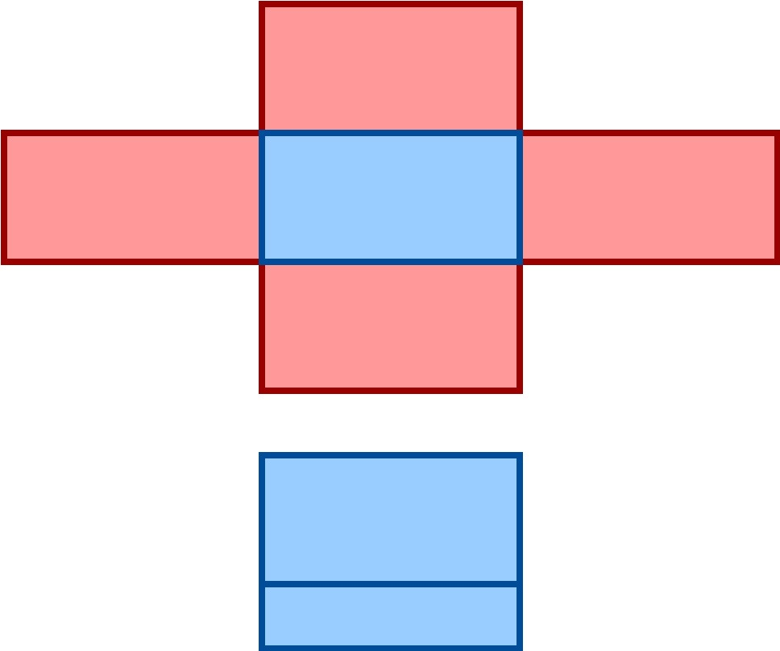

# Hexagons

This is how I solved adding hexagons to games in 2015: 

Choose horizontal or vertical hexagons (I chose horizontal).

## Data

Make a 2D array for the grid (x, y).


Choose if even or odd indexes its north east up or south east down neighbors 

-    Example up (do you do a y -1 or a y 0 when trying to index North East and North West).
-    Example down ( are SW and SE neighbors y 0 or y +1).


For the sake of example I'm going to say Evan is North is up, that means I need to bring the grid on odd columns down 50% in my imagined grid (the original tile should now have up to six neighbors). 

Now the imagined appearance of the array matches a hexagon.


So if you chose Even North is up, like I did neighbors or adjacent tiles can be calculate :

NW is -1, -1 | N is 0, -1 | NE is +1, -1

SE is +1, +1  | S is 0, +1 | SW is -1, +1

Odd, in this example, indexes southern neighbors:

```
NW is -1,  0 | N is 0, -1 | NE is +1,  0
SE is +1, +1 | S is 0, +1 | SW is -1, +1
```


That is how to structure your Data.

Pathing, activated abilities, anything that needs to talk to the grid uses these coordinate offsets. (0, 0) is assumed to be the tile of origin.


## Art

A, "true hexagon," viewed from the top has a side length, called n, a max width 2n (long corner to long corner), and a max height of n multiplied by the square root of 3.


In the attached art I imagine the grid view angle as rotated such that the, "True Hexagons," have a new aspect ratio, I squish the hexagons vertically so their height is now 1n. That's where the 2:1 aspect ratio comes from.


In the art, imagining the hexagon squished vertically means we can now make sprite art in side profil. Anything that doesn't rotate around the grid or animate only needs 1 image.  You can position that sprite / image at the center of the hexagon (if you expand the hexagon like I did so you could add sides use the center of the top, not the image).

hexagons are 2:1


objects are given a side image (not a top down image) 


I used the art solution described above for a square tile instead. In this case no changes are needed in the data layer, only the art.




